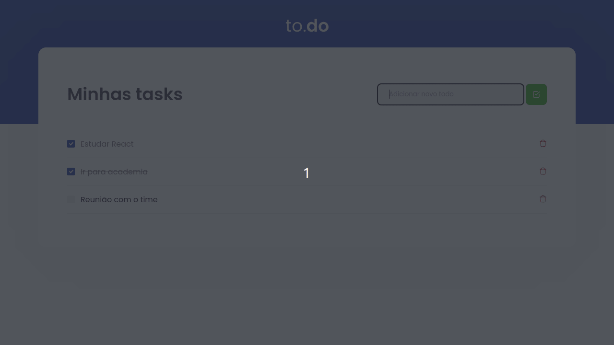

  
  
  
  
  
  
	
  
  
  

  

# Tasklist

## ✒️ Descrição
Neste desafio desenvolvido na _Trilha Ignite_ da Rocketseat foi criado essa aplicação onde o seu principal objetivo é uma pequena aplicação de atividades a fazer, para treinar um pouco mais sobre manipulação do estado no React. Suas principais funções são adicionar uma nova tarefa, remover uma tarefa é marcar e desmarcar uma tarefa como concluída.

## 🚀 Tecnologias utilizadas

 
  
  
  
  
  
  
  
  
  

  
  
  

## 📷 Demostração
Apresentação da tela do aplicativo.

  

## 🔥 Instalação
Clone o repositório.
~~~
git clone git@github.com:vian4dev/app-tasklist.git
~~~
Acesse o diretório do projeto.
~~~
cd app-tasklist/
~~~
Instale as dependências.
~~~
yarn
~~~
Execute a aplicação.
~~~
yarn dev
~~~

## 📝 Licença
Esse projeto está sob a licença MIT. Veja o arquivo [LICENSE](LICENSE) para mais detalhes.

---

 
 
Desenvolvido por - <a href="https://github.com/vian4dev">Gabriel Viana</a> 🤖

 
  

